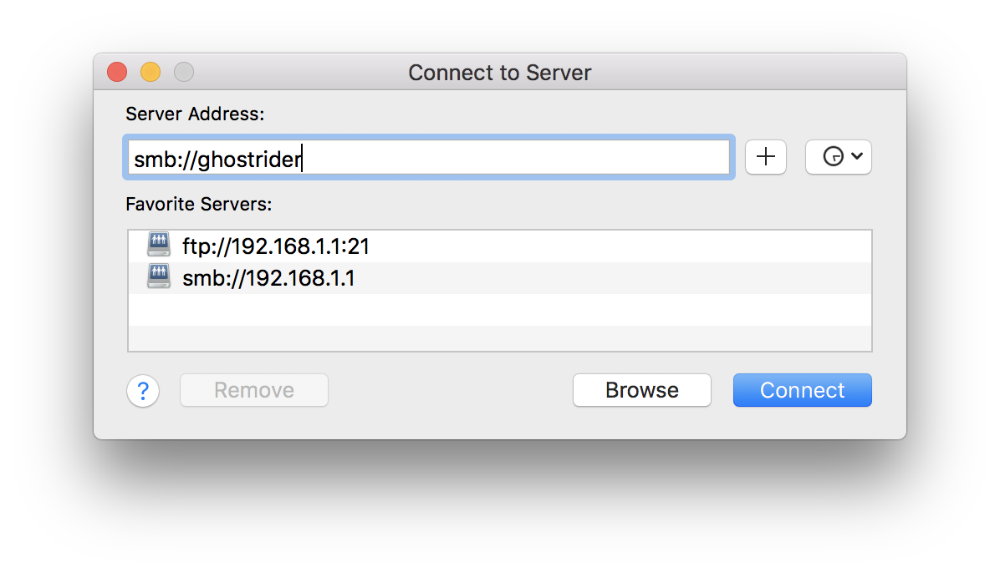

# SSH Access Setup Guides
###### Yi Ru, March 15, 2019

## Table of Contents
* [Introduction](#introduction)
* [Installation](#installation)
	* [Step 1: Client Side](#step-1-client-side)
		* [For Windows](#for-windows)
		* [For Mac](#for-mac)
		* [For Linux](#for-linux)
	* [Step 2: Server Side](#step-2-server-side)
		* [Connect to ghostrider](#connect-to-ghostrider)
		* [Setup Jupyter Notebook for remote access](#setup-jupyter-notebook-for-remote-access)
* [Extra: share drive on ghostrider](#extra-share-drive-on-ghostrider)

## Introduction
Clark Labs now offers a high-performance computer—Lambda workstation (`ghostrider`)—for every coding guys. It provides four extremely fast GPUs to run your deep learning scripts and have it done in seconds. It also provides a Remote Desktop Protocol (RDP) for an easy-to-use remote access. However, using RDP will consume many CPU/GPU and RAM resources of `ghostrider`. Besides, if your connection with `ghostrider` is via Clark VPN, the response from ghostrider sometimes will be very “laggy” or even have no response at all. However, a Secure Shell (`ssh`) connection can not only let you control the machine in a command-line style without consuming too many computing resources, but also avoid the “laggy” situations. Therefore, using `ssh` could be an ideal way to access `ghostrider` remotely. 

`ssh` provides a secure channel over an unsecured network in a client–server architecture, connecting an SSH client application with an SSH server[<sup> 1</sup>](#reference). In other words, it provides a command-line interface on your computer, but controlling the server (the `ghostrider`). There is no GUI at all, only command lines. Thus, the `ghostrider` won't provide you a desktop environment and it won't run any process related to it. And that’s the reason why using SSH can save our valuable computing resources. 

This manual will guide you through the SSH access installation with only a few steps. After setting everything up, you can use Jupyter Notebook on your own device, but running your code on `ghostrider`. (*Even if Jupyter Notebook is not installed on your device!*)
Now let’s get started.

## Installation
### Step 1: Client Side
The first step is add `ghostrider` to your hostname list on your computer. **This operation requires administrator access or sudo permission**. However, you can skip this step if you prefer using IP address to connect, or you don’t have the permission to modify system file. 

The configuration file is saved on `ghostrider: /home/share` folder. All the operations require your device to be connected to the Clark network. (i.e., connected to Clark WiFi or Clark VPN)

#### For Windows:
* Open a File Explorer, type `\\140.232.230.73` in the address bar, press Enter.
	

* A window will pop-up asking for your credentials. Now type your username and password on `ghostrider`. 
* You will see a Folder name `home on Lambda`, open it and navigate to `share\ssh` folder.
* Open `Windows` folder in `share\ssh`, right click on `setup.bat` and select `Run as administrator`. Click Yes when UAC window prompt.
	
* If the script finished without `Access is denied.`, then it means that `ghostrider` was added to your hostname list.   	  

#### For Mac:
* Open a Finder window, press `⌘ + K` and type `smb://140.232.230.73` in Server Address. 
	
* Then type in your credentials for `ghostrider`. If it prompts you to select volumes, select`home on Lambda` and click OK.
* Navigate to `home on Lambda/share/ssh/Mac&Linux`, and you will see a executable file named `setup`.
* Open a terminal window, type in`sudo ` (’sudo’ with a space), then drag the setup file into the terminal, then it will show up like this:
	

* Hit `return`, when it prompts you for password, type the password you used to login your Mac. Noted that your password will NOT show up as `***` here, keep typing then press `return`.
* If the script finished without `Permission denied`, then it means that `ghostrider` was added to your hostname list. 
	
#### For Linux:
* You know how to do it, don't you? ; )

---- 

### Step 2: Server Side
Now the `ghostrider` is added to your hosts list, we can connect it with its hostname through `ssh`. (If you have skipped *Step 1*, use `140.232.230.73` instead of `ghostrider` below.) Currently both Windows and Mac are shipped with `ssh` function. Most of the Linux distributions will also have `ssh` pre-installed. 
* For **Windows** users, please use either Command Prompt or Windows PowerShell to connect `ghostrider`. (Personally I prefer PowerShell)
* For **Mac** and **GUI Linux** users, please use the Terminal. 

	I will use macOS screenshot to illustrate, all the commands are the same on all OS.

#### Connect to ghostrider
* After opening your Terminal/PowerShell, type:
	```bash
	ssh <username>@ghostrider
	```
	* Change `<username>` to your username on ghostrider, then press enter.

* When it is the first time you connect to ghostrider, it will prompt:
	```
	The authenticity of host 'ghostrider (140.232.230.73)' can't be established. 
	ECDSA key fingerprint is SHA256:A-very-long-string-and-totally-nonsense.
	Are you sure you want to continue connecting (yes/no)? yes
	```
	* Please Type yes and press enter.
* Then you will be asked for password, type in your password for accessing `ghostrider`. 
* Now, you are logged into `ghostrider` via `ssh`. Your terminal will look very similar to this:
	
*  Don’t close this window, we will proceed to the next step.   
		  

#### Setup Jupyter Notebook for remote access
* Now type the following command to run the Jupyter configuration file:
```bash
cd ~/../share/ssh
python3 ./run.pyc
```
* Please follow the instructions to go through the setup. You will be asked to select a port number. When finished, your Jupyter Notebook should be good to go.
* Now you can type `jupyter notebook` in your Terminal to start it. Then open your favorite web browser, open `http://ghostrider:your port #`, ignore the password prompt (the script has set it up for you) and click Login, and you are all set!


## Extra: share drive on ghostrider
You might notice that the ghostrider has a share drive function just like how you access `\\sandy`. And yes, after this setup you can access it or map this network drive to your computer simply with `\\ghostrider` or `\\ghostrider\home on Lambda`. (For Mac and Linux is `smb://ghostrider`, `smb://ghostrider/home on Lambda`)

Noted that you will have permission to Read & Write **ONLY** to your own folder and `share` folder. You can read others folder but you don’t have permission to write, modify or delete.

## Reference
1. Wikipedia contributors, "Secure Shell," Wikipedia, The Free Encyclopedia, https://en.wikipedia.org/w/index.php?title=Secure_Shell&oldid=886859004 (accessed March 18, 2019). 
